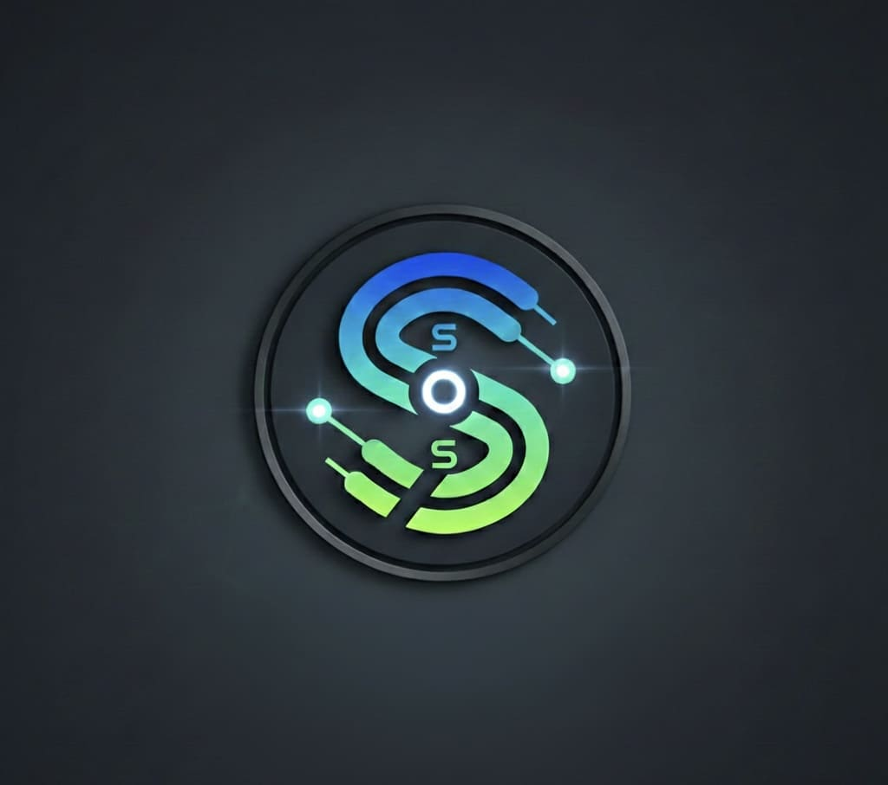

# SOS
<!--
 SPDX-License-Identifier: 0BSD
 SPDX-FileCopyrightText: © 2026 Sebastian Ritter
-->

**SOS** is an Embedded Swift bare metal implementation on ARM64 platform.

 
Kernel   with  <a href="https://swift.org" target="swift">Swift Programming Language</a>.

[Note regarding Swift Package Index bug](https://github.com/SwiftPackageIndex/SwiftPackageIndex-Server/issues/3966)

## Dependencies

**Build:**

- Clang
- Swiftly Toolchain 6+

**Runtime:**

- ARM64-Hardware or QEMU

**Tools:**

- zsh
- reuse

## License

Code is provided under 0BSD license, documentation is provided under CC0-1.0 license.
